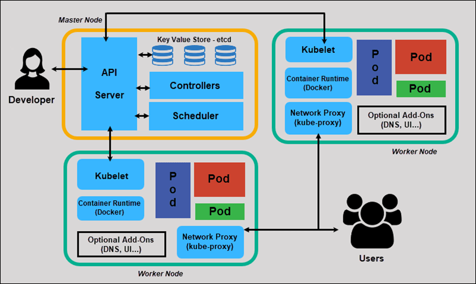

# Kubernetes Basics 🚀

## 1️⃣ Cluster (The Foundation)
A Kubernetes Cluster is the complete environment where containers run.
It has two main parts:

| Component | Purpose |
| :--- | :--- |
| **Control Plane (Master Node)** | Manages the cluster |
| **Worker Nodes** | Run your applications |

**Example structure:**
```text
Kubernetes Cluster
   |
   |--- Control Plane
   |
   |--- Worker Node 1
   |--- Worker Node 2
   |--- Worker Node 3
```

## 2️⃣ Node
A Node is simply a machine inside the cluster. It can be:
- A VM
- A physical server
- A cloud instance

Every node runs:
- Container runtime
- `kubelet`
- `kube-proxy`

> Nodes are where your containers actually run.

## 3️⃣ Pod (Most Important Concept)
A Pod is the smallest deployable unit in Kubernetes.
A Pod can contain:
- 1 container (most common)
- Multiple containers (sidecar pattern)

**Example:**
```text
Pod
 ├── nginx container
 └── log-agent container
```

> **Key idea:** Kubernetes does NOT deploy containers directly. It deploys **Pods**.

## 4️⃣ Deployment
A Deployment manages your Pods. It helps you:
- Create Pods
- Scale Pods
- Update Pods
- Rollback Pods

**Example YAML concept:**
```yaml
apiVersion: apps/v1
kind: Deployment
metadata:
  name: nginx-deployment
spec:
  replicas: 3
```
This means:
➡️ Kubernetes will maintain **3** running pods.
If one crashes, Kubernetes automatically recreates it.

> DevOps engineers use Deployments 90% of the time.

## 5️⃣ Service
Pods have dynamic IP addresses. When a Pod restarts, its IP changes. So we use **Services** to expose Pods acting like a stable endpoint.

**Types of Services:**

| Service Type | Use |
| :--- | :--- |
| **ClusterIP** | Internal communication |
| **NodePort** | Access from outside |
| **LoadBalancer**| Cloud load balancer |
| **ExternalName**| External service |

**Example:**
`User → Service → Pods`

## 6️⃣ Namespace
Namespaces help organize resources in a cluster. This allows multiple teams to share the same cluster.

**Examples:**
- `kube-system`
- `default`
- `dev`
- `production`

## 7️⃣ ConfigMap
Used to store non-sensitive configuration data instead of hardcoding inside a container.

**Example:**
```env
APP_ENV=production
APP_PORT=8080
```

## 8️⃣ Secret
Used for sensitive data:
- Passwords
- API keys
- Tokens

**Example:**
- `DB_PASSWORD`
- `API_TOKEN`

## 9️⃣ Ingress
Ingress manages external HTTP/HTTPS access. This helps with:
- Domain routing
- SSL
- Load balancing

**Example flow:**
```text
Internet
   ↓
Ingress
   ↓
Service
   ↓
 Pods
```

## 🔟 kubectl (Most Important CLI)
The command-line tool to control Kubernetes.

**Examples:**
```bash
kubectl get pods
kubectl get nodes
kubectl get services
kubectl apply -f deployment.yaml
kubectl delete pod pod-name
```
> You will use `kubectl` every day in DevOps.

---

## 🔥 Kubernetes Architecture (Simple View)



```text
                Control Plane
               ┌─────────────┐
               │ API Server  │
               │ Scheduler   │
               │ Controller  │
               └──────┬──────┘
                      │
        ┌─────────────┴─────────────┐
        │                           │
     Worker Node                Worker Node
   ┌──────────────┐           ┌──────────────┐
   │ Pod          │           │ Pod          │
   │ Pod          │           │ Pod          │
   └──────────────┘           └──────────────┘
```

---

## 🎯 10 `kubectl` Commands You Must Know
1. `kubectl get nodes`
2. `kubectl get pods`
3. `kubectl get svc`
4. `kubectl get deployments`
5. `kubectl describe pod <name>`
6. `kubectl logs <pod-name>`
7. `kubectl exec -it <pod> -- bash`
8. `kubectl apply -f file.yaml`
9. `kubectl delete pod <name>`
10. `kubectl get all`

---

## 🚀 Best Learning Order (Important)
Since you are learning Kubernetes now, follow this order:
1. **Pods**
2. **Deployments**
3. **Services**
4. **Namespaces**
5. **ConfigMap & Secret**
6. **Ingress**
7. **Volumes**
8. **Helm**
9. **Monitoring** (Prometheus + Grafana)
10. **CI/CD** with Kubernetes

---

## 💡 Real DevOps Workflow
```text
Developer → Docker Image
            ↓
         Push to Registry
            ↓
       Kubernetes Deployment
            ↓
      Pods Running in Cluster
            ↓
          Service
            ↓
         Users Access
```