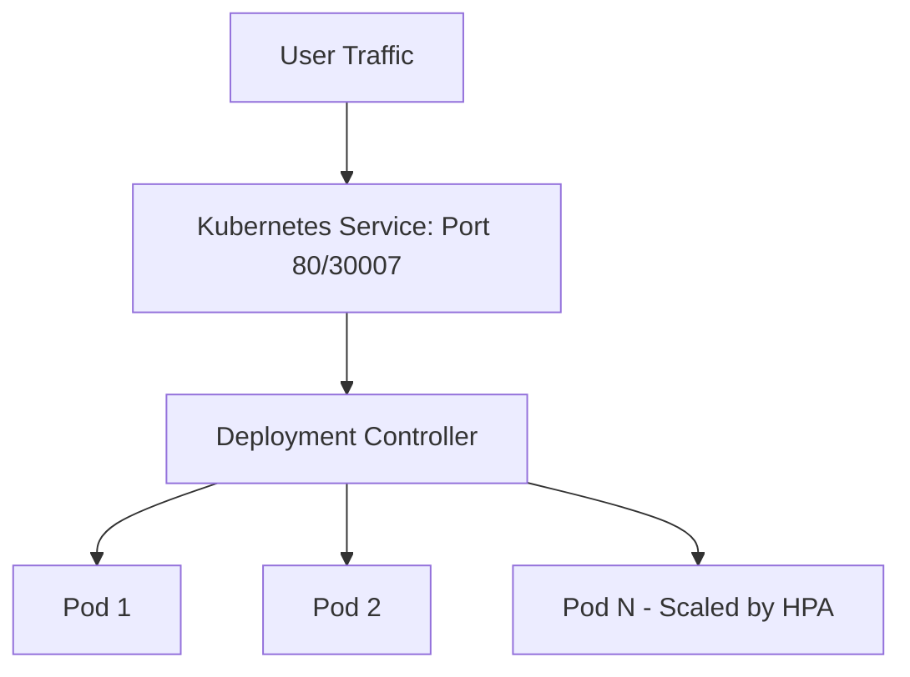

# Kubernetes: Self-Healing & Scaling Lab

This laboratory provides a hands-on guide to understanding and implementing core Kubernetes concepts: **Self-Healing**, **Manual Scaling**, and **Horizontal Pod Autoscaling (HPA)** using a Node.js Express application.

---

## 📑 Table of Contents
- [Prerequisites](#-prerequisites)
- [1. Create Deployment (Self-Healing)](#1-create-deployment-self-healing)
- [2. Testing Self-Healing](#2-testing-self-healing)
- [3. Service Configuration](#3-service-configuration)
- [4. Manual Scaling](#4-manual-scaling)
- [5. Horizontal Pod Autoscaling (HPA)](#5-horizontal-pod-autoscaling-hpa)
- [6. Architecture Flow](#6-architecture-flow)
- [🔥 DevOps Interview Prep](#-devops-interview-prep)

---

## 🛠 Prerequisites

Before starting, ensure you have the following installed:
*   [Docker](https://www.docker.com/)
*   [Kubernetes (kubectl)](https://kubernetes.io/docs/tasks/tools/)
*   [Minikube](https://minikube.sigs.k8s.io/docs/start/)

### Start Environment
```bash
# Start the local cluster
minikube start

# Verify cluster status
kubectl get nodes
```

**Expected Output:**
```text
NAME       STATUS   ROLES           AGE   VERSION
minikube   Ready    control-plane   ...   ...
```

---

## 1. Create Deployment (Self-Healing)

The Deployment controller ensures that a specified number of pod replicas are running at any given time.

### Create `deployment.yaml`
```yaml
apiVersion: apps/v1
kind: Deployment
metadata:
  name: express-demo
spec:
  replicas: 3
  selector:
    matchLabels:
      app: express-demo
  template:
    metadata:
      labels:
        app: express-demo
    spec:
      containers:
      - name: express-demo
        image: ravi0706/express-demo:v1
        ports:
        - containerPort: 3000
```

### Apply Configuration
```bash
kubectl apply -f deployment.yaml

# Monitor application status
kubectl get pods
```

---

## 2. Testing Self-Healing

Kubernetes continuously monitors the state of your pods. If a pod fails or is deleted, the Deployment controller automatically creates a new one to maintain the desired state (`replicas: 3`).

### 🧪 Practical Test
1.  **List current pods:**
    ```bash
    kubectl get pods
    ```
2.  **Delete a pod manually:**
    ```bash
    kubectl delete pod <pod-name>
    ```
3.  **Watch the healing process:**
    ```bash
    kubectl get pods -w
    ```

> [!NOTE]
> You will observe the old pod entering the `Terminating` state while a new pod is immediately `Pending` and then `Running`.

---

## 3. Service Configuration

To access the application from outside the cluster, we need to expose it using a Service.

### Create `service.yaml`
```yaml
apiVersion: v1
kind: Service
metadata:
  name: express-service
spec:
  type: NodePort
  selector:
    app: express-demo
  ports:
  - port: 80
    targetPort: 3000
    nodePort: 30007
```

### Apply and Access
```bash
kubectl apply -f service.yaml

# Access the application via Minikube
minikube service express-service
```

---

## 4. Manual Scaling

You can dynamically increase or decrease the number of replicas based on immediate needs.

```bash
# Scale up to 5 replicas
kubectl scale deployment express-demo --replicas=5

# Scale down to 2 replicas
kubectl scale deployment express-demo --replicas=2
```

---

## 5. Horizontal Pod Autoscaling (HPA)

HPA automatically scales the number of pods in a deployment based on observed CPU utilization.

### Step A: Enable Metrics Server
```bash
minikube addons enable metrics-server

# Verify it's running
kubectl get pods -n kube-system | grep metrics-server
```

### Step B: Configure Autoscaler
```bash
kubectl autoscale deployment express-demo \
  --cpu-percent=50 \
  --min=2 \
  --max=10
```

### Step C: Generate Load & Observe
Run a temporary container to bombard the service with requests:
```bash
kubectl run -i --tty load-generator --rm --image=busybox -- /bin/sh

# Inside the container, run:
while true; do wget -q -O- http://express-service; done
```

**Monitor Scaling Activity:**
```bash
kubectl get hpa -w
```
*You will see the replica count increase from 2 → 5 → 10 as CPU load increases.*

---

## 6. Architecture Flow



---

## 🔥 DevOps Interview Prep

### **Q: What is self-healing in Kubernetes?**
**A:** Kubernetes self-healing is the capability of the cluster to automatically maintain the application's health. It involves:
1.  **Restoration:** Automatically replacing failed or crashed containers.
2.  **Rescheduling:** Moving pods from failed nodes to healthy ones.
3.  **Maintenance:** Killing unresponsive pods (via Liveness Probes) and ensuring the desired state defined in the Deployment is always met.

---
*Created for Learning Kubernetes Lab Series.*
